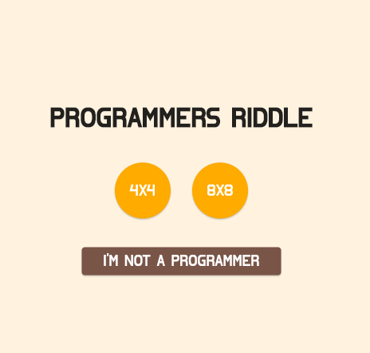
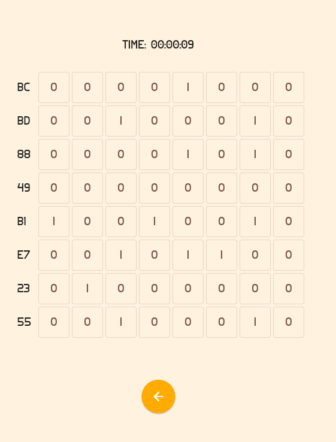
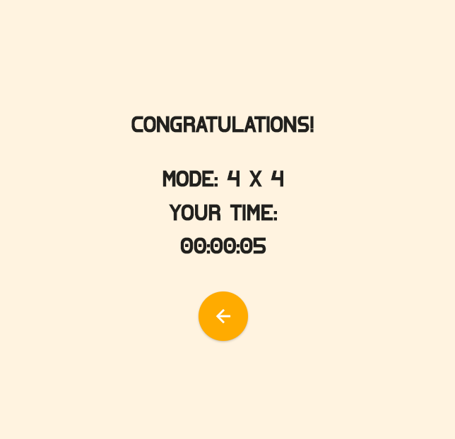

# Programmers Riddle

A minimalistic binary puzzle written in Flutter

##
You can try the web version here: [Programmers Riddle](https://625231eadc93531115434233--superb-kleicha-bf7f7d.netlify.app/#/)
