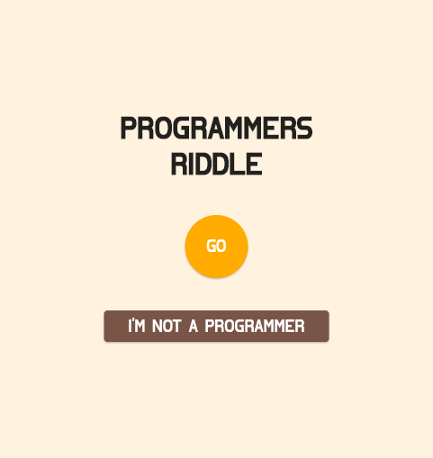
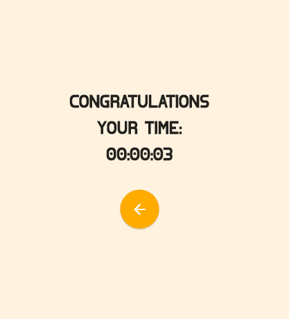

# programmers_riddle

A minimalistic binary puzzle written in Flutter

##
You can try the web version here: [Programmers Riddle](https://62521aa8d793540448b7a72a--superb-kleicha-bf7f7d.netlify.app/#/)
